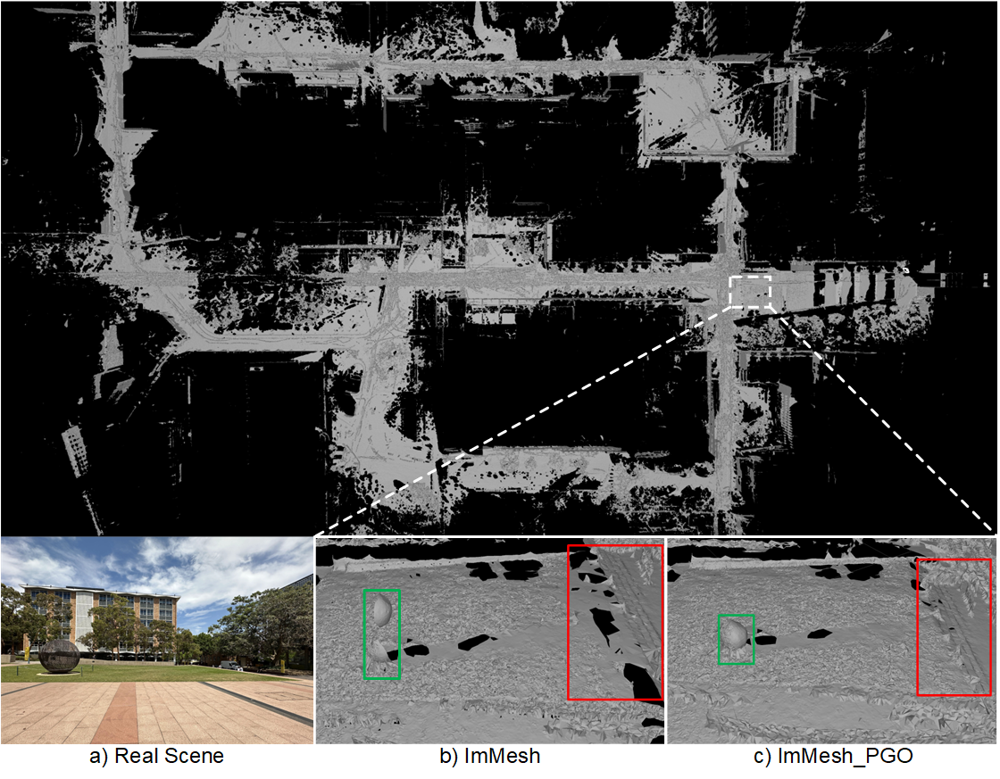

# ImMesh_PGO: An Immediate LiDAR Localization and Meshing Framework with Loop Closure

## Comparison of Consistent Mapping
(Left) Photo of the Scene, (Middle) **ImMesh**, (Right) **ImMesh_PGO** running on [unsw_lowercampus_20240916.bag](https://drive.google.com/file/d/1MKNC0-r70R1s6TmWuQgkmCrFHw4ZtRb8/view?usp=sharing).
<div align="center">

</div>

## 1. Prerequisites
### 1.1 **ROS**
Following this [ROS Installation](http://wiki.ros.org/ROS/Installation) to install ROS and its additional pacakge:<br>
```
sudo apt-get install ros-XXX-cv-bridge ros-XXX-tf ros-XXX-message-filters ros-XXX-image-transport ros-XXX-image-transport*
```
**NOTICE:** remember to replace "XXX" on above command as your ROS distributions, for example, if your use ROS-noetic, the command should be:<br>
```
sudo apt-get install ros-noetic-cv-bridge ros-noetic-tf ros-noetic-message-filters ros-noetic-image-transport*
```
### 1.2. **livox_ros_driver**
Follow this [livox_ros_driver Installation](https://github.com/Livox-SDK/livox_ros_driver).

### 1.3 **CGAL** and **OpenGL**
```
sudo apt-get install -y libcgal-dev pcl-tools
sudo apt-get install -y libgl-dev libglm-dev libglfw3-dev libglew-dev libglw1-mesa-dev 
sudo apt-get install -y libcgal-dev libxkbcommon-x11-dev
```

### 1.4 **GTSAM**
Follow this [GTSAM Get Started](https://gtsam.org/get_started/).

## 2. Build ImMesh on ROS
Clone this repository and catkin_make:
```
cd ~/catkin_ws/src
git clone https://github.com/YixFeng/ImMesh_PGO.git
cd ../
catkin_make
source ~/catkin_ws/devel/setup.bash
```

## 3. Run
Use this command, you can run [unsw_lowercampus_20240916.bag](https://drive.google.com/file/d/1MKNC0-r70R1s6TmWuQgkmCrFHw4ZtRb8/view?usp=sharing).
```
roslaunch immesh_pgo mapping_horizon.launch
rosbag play unsw_lowercampus_20240916.bag
```
Since I only incrementally updated the mesh after the loop-closure optimization, the old mesh features have not been removed and will be mixed with the new ones.

If you want to have a map constructed from loop-closure-optimized poses, you can follow instructions below:

1. Run ImMesh_PGO.
```
roslaunch immesh_pgo mapping_horizon.launch
```
2. Click "Save PGO Cloud to file" in the UI and you will get a corrected pointcloud in your `~/ImMesh_PGO` directory.

3. Build the mesh using the pointcloud. You need to change the path in the launch file.
```
roslaunch immesh_pgo mapping_pointcloud.launch
```

## Acknowledgement
Thanks for following open-sourced repositories and authors:
- [ImMesh: An Immediate LiDAR Localization and Meshing Framework](https://github.com/hku-mars/ImMesh)
- [STD: A Stable Triangle Descriptor for 3D place recognition](https://github.com/hku-mars/STD)
- [FAST_LIO_SLAM: Integration of FAST-LIO2 and Scan Context-based Loop Detection](https://github.com/gisbi-kim/FAST_LIO_SLAM)